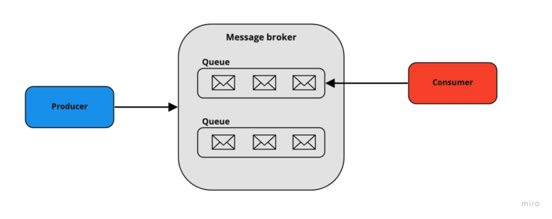

## 💬 Message Broker 💬

### 📚 Description 📚
This is a message broker that allows you to send messages to a queue and receive them from the queue. It is a simple implementation of a message broker that uses a queue to store messages. The queue is implemented using a linked list. The message broker is implemented using a server and a client. The server is multithreaded and can handle multiple clients at the same time. The client can send messages to the queue and receive messages from the queue. The client can also send a message to the server to stop the server. The server can also be stopped by pressing Ctrl+C.



```bash
type MessageBroker interface {
	SendMessage(ctx context.Context, message Message, topic string) error
	ReceiveMessages(ctx context.Context, topic string) (*Message, error)
	Ack(ctx context.Context) error
}
```

### 📝 Instructions 📝

### 📥 Installation 📥
```bash
go get github.com/fabiohvieira/broker
```

### Providers Available ###

#### AWS - SQS ####
```bash
func main() {
    sqsClient := sqs.NewSQSClient("us-east-1", "http://localhost:4100", "http://localhost:4100", "http://localhost:4100", "http://localhost:4100")
  
    broker := sqs.New(sqsClient)

    broker.SendMessage("test", "test")
}
```

#### RabbitMQ ####

- [x] Send Message

#### Kafka ####
